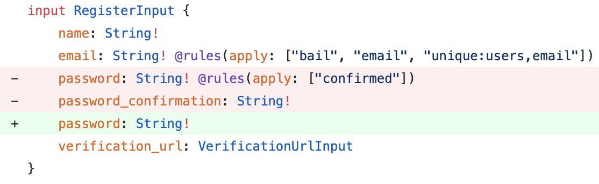
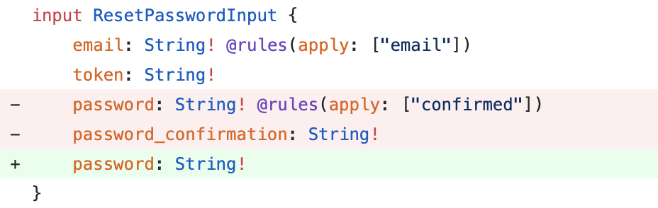

# 3.3 Lighthouse Sanctum

Laravel Sanctum support for Laravel Lighthouse [Youtube Series](https://www.youtube.com/watch?v=ZhclQg8PK8I&t=207s)

## 3.3.1 First get the PHP package with composer

```shell
cd /var/www/api.securezone.co.za/public_html
composer require daniel-de-wit/lighthouse-sanctum
```

## 3.3.2 Publish configuration and schema

```shell
php artisan vendor:publish --tag=lighthouse-sanctum
```

## 3.3.3 Import the published schema into your main GraphQL schema `(./graphql/schema.graphql)`

```shell
type Query
type Mutation

#import sanctum.grapqhl
```

## 3.3.4 HasApiTokens

Apply the `Laravel\Sanctum\HasApiTokens` trait to your `Authenticatable` model as described in the [Laravel Sanctum documentation.](Apply the Laravel\Sanctum\HasApiTokens trait to your Authenticatable model as described in the Laravel Sanctum documentation.)

```php
use Illuminate\Auth\Authenticatable;
use Laravel\Sanctum\Contracts\HasApiTokens as HasApiTokensContract;
use Laravel\Sanctum\HasApiTokens;

class User extends Authenticatable implements HasApiTokensContract
{
    use HasApiTokens;
}
```

### 3.3.5 Configuration

This package relies on `API Token Authentication`, which uses stateless Bearer tokens to authenticate requests.

By default, `Laravel Sanctum` assumes that requests made from localhost should use the stateful `Spa Authentication` instead. To disable this behaviour, remove any lines in your sanctum configuration:

```php
// File: ./config/sanctum.php

    /*
    |--------------------------------------------------------------------------
    | Stateful Domains
    |--------------------------------------------------------------------------
    |
    | Requests from the following domains / hosts will receive stateful API
    | authentication cookies. Typically, these should include your local
    | and production domains which access your API via a frontend SPA.
    |
    */

    'stateful' => [
        // Remove entries here    
    ],
```

Make sure the following middleware is enabled for Lighthouse:

```php
// File: ./config/lighthouse.php
    'middleware' => [
        ...
        
        \Nuwave\Lighthouse\Support\Http\Middleware\AttemptAuthentication::class,

        ...
    ],
```

## 3.3.6 Usage

### 3.3.6.1 Login

Authenticate the user to receive a Bearer token.

```gql
mutation Login {
    login(input: {
        email: "john.doe@gmail.com"
        password: "secret"
    }) {
        token
    }
}
```

Apply the Authorization header on subsequent calls using the token

```http
 "Authorization": "Bearer 1|lJo1cMhrW9tIUuGwlV1EPjKnvfZKzvgpGgplbwX9"
```

### 3.3.6.2 Logout

Revoke the current token.

```gql
mutation Logout {
    logout {
        status
        message
    }
}
```

### 3.3.6.3 Register

Successfully registering a user will immediately yield a bearer token (unless email verification is required).

```gql
mutation Register {
    register(input: {
        name: "John Doe"
        email: "john.doe@gmail.com"
        password: "secret"
        password_confirmation: "secret"
    }) {
        token
        status
    }
}
```

Want to disable password confirmation? Update your schema


When registering a user in combination with the MustVerifyEmail contract you can optionally define the url for email verification. Both __ID__ and __HASH__ will be replaced with the proper values.

```gql
mutation Register {
    register(input: {
        name: "John Doe"
        email: "john.doe@gmail.com"
        password: "secret"
        password_confirmation: "secret"
        verification_url: {
            url: "https://my-front-end.com/verify-email?id=__ID__&token=__HASH__"
        }
    }) {
        token
        status
    }
}
```

### 3.3.6.4 Email Verification

```gql
mutation VerifyEmail {
  verifyEmail(input: {
    id: "1"
    hash: "af269947ed80d4a7bc3f78a6dfd05ec369373f9d"
  }) {
    name
    email
  }
}
```

### 3.3.6.5 Forgot Password

Sends a reset password notification.

Optionally use custom reset url using both __EMAIL__ and __TOKEN__ placeholders.

```gql
mutation ForgotPassword {
    forgotPassword(input: {
        email: "john.doe@gmail.com"
        reset_password_url: {
            url: "https://my-front-end.com/reset-password?email=__EMAIL__&token=__TOKEN__"
        }
    }) {
        status
        message
    }
}
```

### 3.3.6.6 Reset Password

Reset the user's password.

```gql
mutation ResetPassword {
    resetPassword(input: {
        email: "john.doe@gmail.com",
        token: "af269947ed80d4a7bc3f78a6dfd05ec369373f9d"
        password: "secret"
        password_confirmation: "secret"
    }) {
        status
        message
    }
}
```

 Want to disable password confirmation? Update your schema


### 3.3.6.7 Testing

```shell
composer test
```

### 3.3.6.8 Coverage

```shell
composer coverage
```

### 3.3.6.9 Static Analysis

```shell
composer analyze
```
